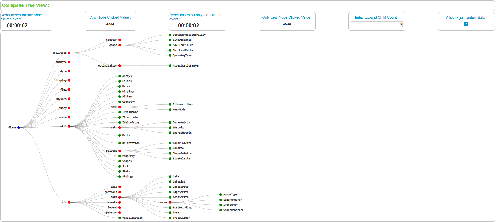

# TWX Collapsible Tree Widget

## Usage
The ThingWorx Collapsible Tree Widget is based on [D3.js](https://observablehq.com/@d3/collapsible-tree) and enables visualization of hierarchical models in a structured format within a ThingWorx mashup.

## Installation
### Prerequisites
- ThingWorx 9.x or later
- D3.js library (included in the widget package)

### Setup Steps
1. **Download the Extension**
   - Locate the ZIP file at `build/distributions/TWXCollapsibleTree.zip`.
2. **Import into ThingWorx**
   - Navigate to *ThingWorx Composer* > *Import/Export* > *Import*.
   - Select `TWXCollapsibleTree.zip` and import it.
3. **Use the Widget**
   - Add the *Collapsible Tree* widget to a mashup.
   - Bind data and configure properties as needed.

## Widget Configuration
### Properties
- **CollapsibleTreeData** *(JSON)*: Data source for the tree structure.
- **InitialExpandedChildCount** *(INTEGER)*: Number of child nodes initially expanded.
- **LeafNodeClickedValue** *(STRING)*: Outputs value when a leaf node is clicked.
- **NodeClickedValue** *(STRING)*: Outputs value when any node is clicked.
- **BaseTreeStyle** *(STYLEDEFINITION)*: Defines the visual style of the tree.
- **CustomClass** *(STRING)*: Allows applying custom CSS classes.

### Data Format (JSON)
The widget expects a JSON structure similar to:
```json
{
  "name": "Root",
  "value": "Root Value",
  "children": [
    {
      "name": "Child 1",
      "value": "Child Value 1",
      "children": [
        {
          "name": "Leaf 1",
          "value": "Leaf Value 1"
        },
        {
          "name": "Leaf 2",
          "value": "Leaf Value 2"
        }
      ]
    },
    {
      "name": "Child 2",
      "value": "Child Value 2"
    }
  ]
}
```
### Events
- **LeafNodeClicked**: Triggered when a leaf node is clicked.
- **NodeClicked**: Triggered when any node (leaf or non-leaf) is clicked.
  
## Sample
1. **Download the Sample file**
   - Locate the XML file at `SampleEntities/CollapsibleTreeWidgetEntities.xml`.
2. **Import into ThingWorx**
   - Navigate to *ThingWorx Composer* > *Import/Export* > *Import*.
   - Select `CollapsibleTreeWidgetEntities.xml` and import it.
3. **View/Edit the Sample Mashup**
   - View the mashup *ACC_CollapsibleTree_MU*.
   - Refer the sample data in the Thing *ACC_CollapsibleTree_TH* and configure properties as mentioned in sample file.
 ### Runtime Sample View 
 
 [Download and watch the video](SampleEntities/TWXCollapsible TreeWidget-Video.mp4)
        
# Authors
**Arun Chinnusamy** - Accenture - Industry X Team, Bangalore

# Disclaimer
By downloading this widget/software, the user acknowledges that it is unsupported, not reviewed for security purposes, and that the user assumes all risk for running it.

Users accept all risk whatsoever regarding the security of the code they download.

This software is not an official PTC product and is not officially supported by PTC.

PTC is not responsible for any maintenance for this software.

PTC will not accept technical support cases logged related to this Software.

This source code is offered freely and AS IS without any warranty.

The author of this code cannot be held accountable for the well-functioning of it.

The author shared the code that worked at a specific moment in time using specific versions of PTC products at that time, without the intention to make the code compliant with past, current or future versions of those PTC products.

The author has not committed to maintain this code and he may not be bound to maintain or fix it.


# License
I accept the [MIT License](https://opensource.org/licenses/MIT) and agree that any software downloaded/utilized will be in compliance with that Agreement. However, despite anything to the contrary in the License Agreement, I agree as follows:

I acknowledge that I am not entitled to support assistance with respect to the software, and PTC will have no obligation to maintain the software or provide bug fixes or security patches or new releases.

The software is provided “As Is” and with no warranty, indemnitees or guarantees whatsoever, and PTC will have no liability whatsoever with respect to the software, including with respect to any intellectual property infringement claims or security incidents or data loss.

I acknowledge that I am not entitled to support assistance with respect to the software, and PTC will have no obligation to maintain the software or provide bug fixes or security patches or new releases.

The software is provided “As Is” and with no warranty, indemnitees or guarantees whatsoever, and PTC will have no liability whatsoever with respect to the software, including with respect to any intellectual property infringement claims or security incidents or data loss.

